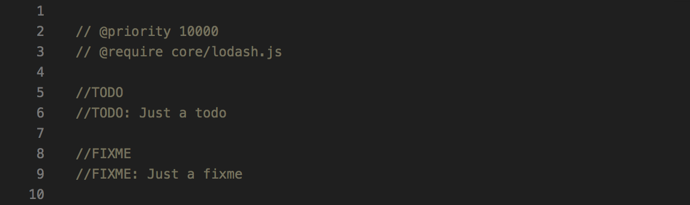
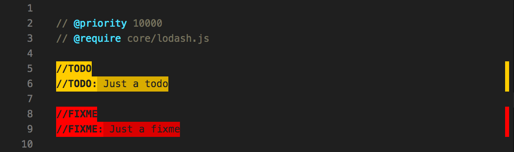

# Highlight

<p align="center">
  
</p>

Advanced text highlighter based on regexes. Useful for todos, annotations etc.

There are other extensions that can be used for this, like [TODO Highlight](https://marketplace.visualstudio.com/items?itemName=wayou.vscode-todo-highlight), but this is more generic, this can apply different styles to different capturing groups within the same regex, and this is focused on doing only one thing and doing it well.

## Install

Follow the instructions in the [Marketplace](https://marketplace.visualstudio.com/items?itemName=fabiospampinato.vscode-highlight), or run the following in the command palette:

```shell
ext install fabiospampinato.vscode-highlight
```

## Settings

```js
{
  "highlight.decorations": { "rangeBehavior": 3 }, // Default decorations from which all others inherit from
  "highlight.regexFlags": "gi", // Default flags used when building the regexes
  "highlight.regexes": {}, // Object mapping regexes to options or an array of decorations to apply to the capturing groups
  "highlight.maxMatches": 250 // Maximum number of matches per regex to decorate
}
```

An example configuration could be:

```js
"highlight.regexes": {
  "(//TODO)(:)": [ // A regex will be created from this string, don't forget to double escape it
    { "color": "yellow" }, // Decoration options to apply to the first capturing group, in this case "//TODO"
    { "color": "red" } // Decoration options to apply to the second capturing group, in this case ":"
  ]
}
```

If you want to have different regex flags for different regexes, or if you want to apply the decorations on a per-language/file basis you'll have to express your configuration like this:

```js
"highlight.regexes": {
  "(//TODO)(:)": { // A regex will be created from this string, don't forget to double escape it
    "regexFlags": "g", // Flags used when building this regex
    "filterLanguageRegex": "markdown", // Apply only if current file's language matches this regex. Requires double escaping
    "filterFileRegex": ".*\\.ext", // Apply only if the current file's path matches this regex. Requires double escaping
    "decorations": [ // Decoration options to apply to the capturing groups
      { "color": "yellow" }, // Decoration options to apply to the first capturing group, in this case "//TODO"
      { "color": "red" } // Decoration options to apply to the second capturing group, in this case ":"
    ]
  }
}
```

**Note:** All characters of the matched string must be wrapped in a capturing group, and for each capturing group a decorations options object must be provided (empty decorations are allowed: `{}`), otherwise the actual decorations will be misaligned.

**Note:** Nested capturing groups are not supported.

A much more robust string for matching todos, with support for JavaScript/HTML-style comments, urls, multiple todos in a single line, and [Todo+](https://marketplace.visualstudio.com/items?itemName=fabiospampinato.vscode-todo-plus)-style tags would look like this:

```js
"((?:<!-- *)?(?:#|//|/\\*+|<!--|--|\\* @) *TODO(?:\\s*\\([^)]+\\))?:?)((?!\\w)(?: *-->| *\\*/|(?= *(?:[^:]//|/\\*+|<!--|@|--))|(?: +[^\\n@]*?)(?= *(?:[^:]//|/\\*+|<!--|@|--(?!>)))|(?: +[^@\\n]+)?))"
```

All the supported decoration options are defined [here](https://code.visualstudio.com/docs/extensionAPI/vscode-api#DecorationRenderOptions).

## Demo

The following configuration:

```js
"highlight.regexes": {
  "(// ?TODO:?)(.*)": [
    {
      "overviewRulerColor": "#ffcc00",
      "backgroundColor": "#ffcc00",
      "color": "#1f1f1f",
      "fontWeight": "bold"
    },
    {
      "backgroundColor": "#d9ad00",
      "color": "#1f1f1f"
    }
  ],
  "(// ?FIXME:?)(.*)": [
    {
      "overviewRulerColor": "#ff0000",
      "backgroundColor": "#ff0000",
      "color": "#1f1f1f",
      "fontWeight": "bold"
    },
    {
      "backgroundColor": "#d90000",
      "color": "#1f1f1f"
    }
  ],
  "(// )(@\\w+)": [
    {},
    {
      "color": "#4de0ff"
    }
  ]
}
```

Transforms this:



Into this:



## Hints

- **Todo**: If you're using this extension for highlighting todos, I recommend using [Todo+](https://marketplace.visualstudio.com/items?itemName=fabiospampinato.vscode-todo-plus) as well.

## Contributing

If you found a problem, or have a feature request, please open an [issue](https://github.com/fabiospampinato/vscode-highlight/issues) about it.

If you want to make a pull request you can debug the extension using [Debug Launcher](https://marketplace.visualstudio.com/items?itemName=fabiospampinato.vscode-debug-launcher).

## License

MIT © Fabio Spampinato
