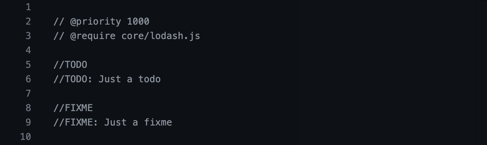
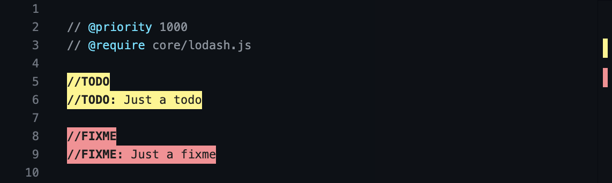
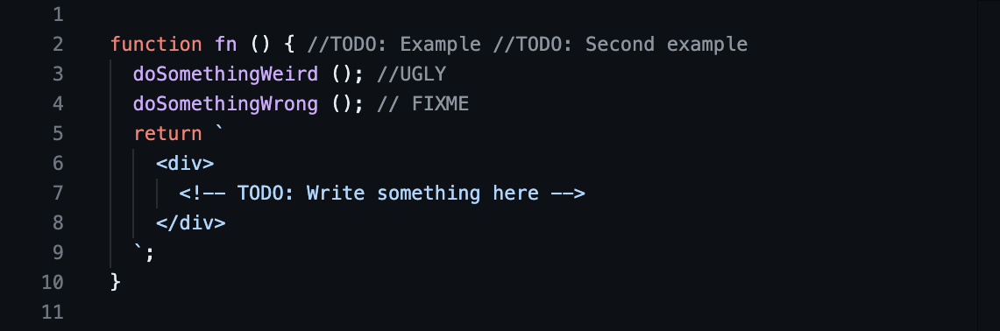
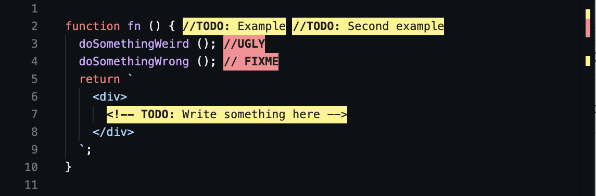
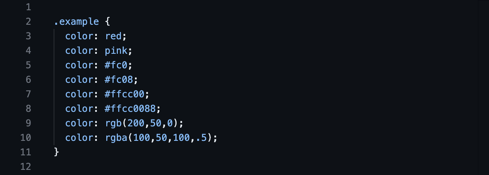
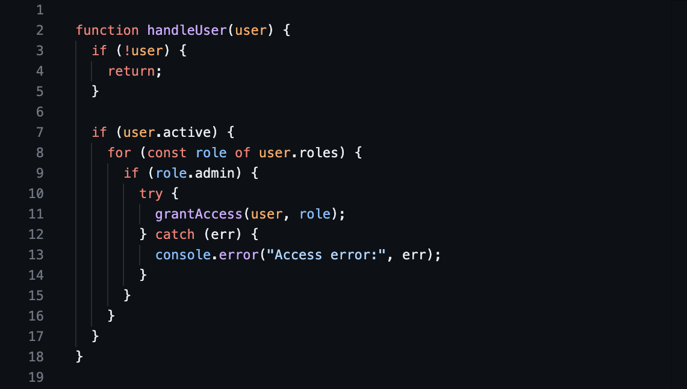
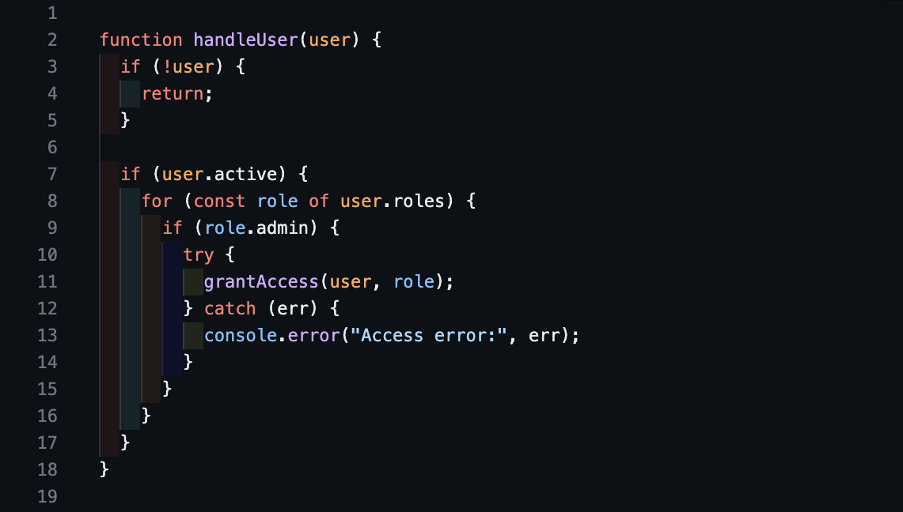
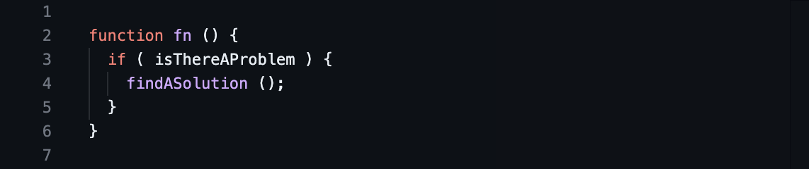
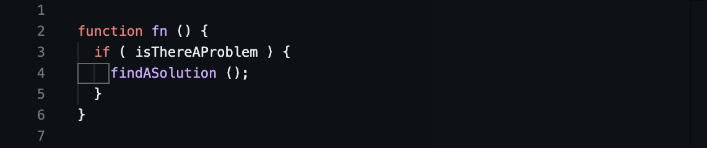

# Highlight

<p align="center">
  
</p>

Advanced text highlighter based on regexes. Useful for todos, annotations, colors etc.

There are alternative extensions that you may be considering, like [TODO Highlight](https://marketplace.visualstudio.com/items?itemName=wayou.vscode-todo-highlight), but this is more generic, this can apply different styles to different capturing groups within the same regex, and this is focused on doing only one thing and doing it _well_.

This extension has been optimized for "intraline" regexes, i.e. regexes that can never possibly match a newline character at any point inside them, which when editing a file enables the extension to redecorate only the parts of the file that changed, caching everything else, for a massive speedup.

## Install

Follow the instructions in the [Marketplace](https://marketplace.visualstudio.com/items?itemName=fabiospampinato.vscode-highlight), or run the following in the command palette:

```shell
ext install fabiospampinato.vscode-highlight
```

## Commands

It adds 3 commands to the command palette:

```js
'Highlight: Enable Highlights' // Enable all highlights
'Highlight: Disable Highlights' // Disable all highlights
'Highlight: Toggle Highlights' // Toggle all highlights on/off
```

## Settings

```js
{
  "highlight.decorations": { "rangeBehavior": 3 }, // Default decorations from which all others inherit from
  "highlight.regexFlags": "gi", // Default flags used when building the regexes
  "highlight.regexes": {}, // Object mapping regexes to options or an array of decorations to apply to the capturing groups
}
```

An example configuration could be:

```js
"highlight.regexes": {
  "(//TODO)(:)": [ // A regex will be created from this string, don't forget to double escape it
    { "color": "yellow" }, // Decoration options to apply to the first capturing group, in this case "//TODO"
    { "color": "red" } // Decoration options to apply to the second capturing group, in this case ":"
  ]
}
```

If you want to have different regex flags for different regexes, or if you want to apply the decorations on a per-language/file basis you'll have to express your configuration like this:

```js
"highlight.regexes": {
  "(//TODO)(:)": { // A regex will be created from this string, don't forget to double escape it
    "regexFlags": "g", // Flags used when building this regex
    "filterFileRegex": ".*\\.ext", // Apply only if the current file's path matches this regex. Requires double escaping
    "filterLanguageRegex": "markdown", // Apply only if current file's language matches this regex. Requires double escaping
    "filterThemeRegex": ".*Dark.*", // Apply only if the current theme matches this regex. Requires double escaping
    "decorations": [ // Decoration options to apply to the capturing groups
      { "color": "yellow" }, // Decoration options to apply to the first capturing group, in this case "//TODO"
      { "color": "red" } // Decoration options to apply to the second capturing group, in this case ":"
    ]
  }
}
```

You can also express regex flags within the regex itself, but writing it like this:

```js
"highlight.regexes": {
  "/(//TODO)(:)/g": [...] // By wrapping the regex in forward slashes it's parsed as a regex with explicit flags
}
```

Decoration values can also include placeholders like `$1` or `$2` that will be replaced with the content of the respective capturing group, enabling complex use cases like CSS colors highlighting.

All the supported decoration options are defined [here](https://code.visualstudio.com/docs/extensionAPI/vscode-api#DecorationRenderOptions).

## Warnings

1. Regexes need to be double-escaped, once for JSON and the second time for the regex itself. For example if you want to match a literal asterisk you should write `\\*`, not just `\*`.
2. For each capturing group a decorations options object must be provided (empty decorations are allowed: `{}`), otherwise the actual decorations will be misaligned.
3. If you want to match the start/end of a line make sure the regex has the "m" (multiline) flag.

## Demo

### Basic

The following configuration:

<details>
<summary>Show configuration...</summary>

```js
"highlight.regexes": {
  "(// ?TODO:?)(.*)": [
    {
      "overviewRulerColor": "#FFF484",
      "backgroundColor": "#FFF484",
      "color": "#1F1F1F",
      "fontWeight": "bold"
    },
    {
      "backgroundColor": "#FFF484",
      "color": "#1F1F1F"
    }
  ],
  "(// ?FIXME:?)(.*)": [
    {
      "overviewRulerColor": "#FF8C92",
      "backgroundColor": "#FF8C92",
      "color": "#1F1F1F",
      "fontWeight": "bold"
    },
    {
      "backgroundColor": "#FF8C92",
      "color": "#1F1F1F"
    }
  ],
  "// (@\\w+)": [
    {
      "color": "#4DE0FF"
    }
  ]
}
```

</details>

Transforms this:



Into this:



### Advanced Todos

The following is the configuration I'm currently using for highlighting todos, it's _much_ more robust than the previous demo configuration, and it supports JavaScript/HTML-style comments, urls, multiple todos in a single line, common templating languages, and [Todo+](https://marketplace.visualstudio.com/items?itemName=fabiospampinato.vscode-todo-plus)-style tags.

<details>
<summary>Show configuration...</summary>

```js
"highlight.regexFlags": "gi",
"highlight.regexes": {
  "((?:<!-- *)?(?:#|// @|//|./\\*+|<!--|--|\\* @|{!|{{!--|{{!) *TODO(?:[\\t\\f\\v ]*\\([^\\r\\n)]+\\))?:?)((?!\\w)(?: *-->| *\\*/| *!}| *--}}| *}}|(?= *(?:[^\\r\\n:]//|/\\*+|<!--|@|--|{!|{{!--|{{!))|(?: +[^\\r\\n@]*?)(?= *(?:[^\\r\\n:]//|/\\*+|<!--|@|--(?!>)|{!|{{!--|{{!))|(?: +[^\\r\\n@]+)?))": {
    "filterFileRegex": ".*(?<!CHANGELOG.md)$",
    "decorations": [
      {
        "overviewRulerColor": "#FFF484",
        "backgroundColor": "#FFF484",
        "color": "#1f1f1f",
        "fontWeight": "bold"
      },
      {
        "backgroundColor": "#FFF484",
        "color": "#1f1f1f"
      }
    ]
  },
  "((?:<!-- *)?(?:#|// @|//|./\\*+|<!--|--|\\* @|{!|{{!--|{{!) *(?:FIXME|FIX|BUG|UGLY|DEBUG|HACK)(?:[\\t\\f\\v ]*\\([^\\r\\n)]+\\))?:?)((?!\\w)(?: *-->| *\\*/| *!}| *--}}| *}}|(?= *(?:[^\\r\\n:]//|/\\*+|<!--|@|--|{!|{{!--|{{!))|(?: +[^\\r\\n@]*?)(?= *(?:[^\\r\\n:]//|/\\*+|<!--|@|--(?!>)|{!|{{!--|{{!))|(?: +[^\\r\\n@]+)?))": {
    "filterFileRegex": ".*(?<!CHANGELOG.md)$",
    "decorations": [
      {
        "overviewRulerColor": "#FF8C92",
        "backgroundColor": "#FF8C92",
        "color": "#1f1f1f",
        "fontWeight": "bold"
      },
      {
        "backgroundColor": "#FF8C92",
        "color": "#1f1f1f"
      }
    ]
  }
}
```

</details>

Transforms this:



Into this:



### Colors

The following is the configuration I'm currently using for highlighting colors, like `red`, `#ff0000`, `rgba(255,0,0)` etc.

<details>
<summary>Show configuration...</summary>

```js
"highlight.regexFlags": "gi",
"highlight.regexes": {
  "(?<!\\w)(#[a-f0-9]{3,4}|#[a-f0-9]{6}|#[a-f0-9]{8}|rgba?[\\t\\f\\v ]*\\([^\\r\\n)]*?\\)|hsla?[\\t\\f\\v ]*\\([^\\r\\n)]*?\\)|aliceblue|antiquewhite|aqua|aquamarine|azure|beige|bisque|black|blanchedalmond|blue|blueviolet|brown|burlywood|cadetblue|chartreuse|chocolate|coral|cornflowerblue|cornsilk|crimson|cyanaqua|darkblue|darkcyan|darkgoldenrod|darkgray|darkgreen|darkgrey|darkkhaki|darkmagenta|darkolivegreen|darkorange|darkorchid|darkred|darksalmon|darkseagreen|darkslateblue|darkslategray|darkslategrey|darkturquoise|darkviolet|deeppink|deepskyblue|dimgray|dimgrey|dodgerblue|firebrick|floralwhite|forestgreen|fuchsia|gainsboro|ghostwhite|gold|goldenrod|gray|green|greenyellow|grey|honeydew|hotpink|indianred|indigo|ivory|khaki|lavender|lavenderblush|lawngreen|lemonchiffon|lightblue|lightcoral|lightcyan|lightgoldenrodyellow|lightgray|lightgreen|lightgrey|lightpink|lightsalmon|lightseagreen|lightskyblue|lightslategray|lightslategrey|lightsteelblue|lightyellow|lime|limegreen|linen|magenta|maroon|mediumaquamarine|mediumblue|mediumorchid|mediumpurple|mediumseagreen|mediumslateblue|mediumspringgreen|mediumturquoise|mediumvioletred|midnightblue|mintcream|mistyrose|moccasin|navajowhite|navy|oldlace|olive|olivedrab|orange|orangered|orchid|palegoldenrod|palegreen|paleturquoise|palevioletred|papayawhip|peachpuff|peru|pink|plum|powderblue|purple|rebeccapurple|red|rosybrown|royalblue|saddlebrown|salmon|sandybrown|seagreen|seashell|sienna|silver|skyblue|slateblue|slategray|slategrey|snow|springgreen|tan|teal|thistle|turquoise|violet|wheat|white|whitesmoke|yellow|yellowgreen)(?!\\w)": {
    "decorations": [
      {
        "rangeBehavior": 1,
        "borderWidth": "2px",
        "borderStyle": "solid",
        "borderColor": "$1",
        "backgroundColor": "$1",
        "color": "#ffffff"
      }
    ]
  }
}
```

</details>

Transforms this:



Into this:


### Rainbow Indentation

Some creative uses of this extension are also possible, for example you can make indentation more visible with the following configuration.

<details>
<summary>Show configuration...</summary>

```js
"highlight.regexes": {
  "/^(  |\\t)(  |\\t)?(  |\\t)?(  |\\t)?(  |\\t)?(  |\\t)?(  |\\t)?(  |\\t)?(  |\\t)?/gm": {
    "decorations": [
      { "backgroundColor": "#FF000015" },
      { "backgroundColor": "#00FFFF15" },
      { "backgroundColor": "#FF7F0015" },
      { "backgroundColor": "#0000FF15" },
      { "backgroundColor": "#FFFF0015" },
      { "backgroundColor": "#8B00FF15" },
      { "backgroundColor": "#00FF0015" },
      { "backgroundColor": "#FF00FF15" },
      { "backgroundColor": "#4B008215" }
    ]
  }
}
```

</details>

Transforms this:



Into this:



### Mixed Indentation

It can also be used to highlight inconsistent indentation, where perhaps spaces and tabs are mixed but it's not immediately obvious.

<details>
<summary>Show configuration...</summary>

```js
"highlight.regexes": {
  "(\t+)": {
    "decorations": [
      {
        "borderWidth": "1px",
        "borderStyle": "solid",
        "borderColor": "#666666",
        "rangeBehavior": 1
      }
    ]
  }
}
```

</details>

Transforms this:



Into this:



## Hints

- **Todo**: If you're using this extension for highlighting todos, I recommend using [Todo+](https://marketplace.visualstudio.com/items?itemName=fabiospampinato.vscode-todo-plus) as well.
- **Defaults**: Some default decorations for todos and fixmes are provided, you can remove or change them by editing your settings. Keep in mind that this extension is agnostic to what can be highlighted, and it's not limited to just highlighting todos.
- **Decorations**: All the supported decoration options are defined [here](https://code.visualstudio.com/docs/extensionAPI/vscode-api#DecorationRenderOptions).

## License

MIT © Fabio Spampinato
