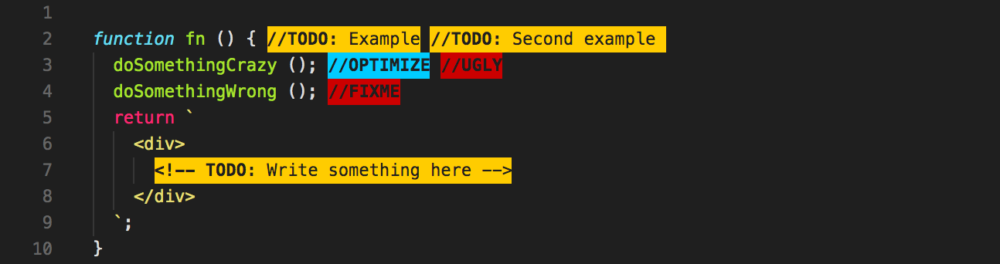
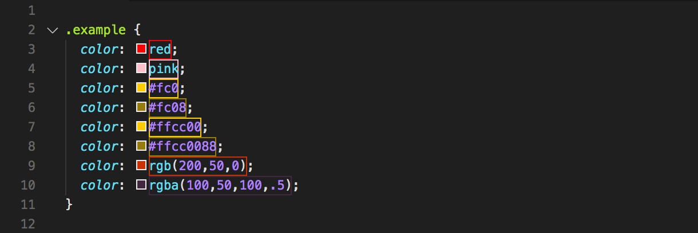

# Highlight

<p align="center">
  
</p>

Advanced text highlighter based on regexes. Useful for todos, annotations, colors etc.

There are alternative extensions that you may be considering, like [TODO Highlight](https://marketplace.visualstudio.com/items?itemName=wayou.vscode-todo-highlight), but this is more generic, this can apply different styles to different capturing groups within the same regex, and this is focused on doing only one thing and doing it _well_.

## Install

Follow the instructions in the [Marketplace](https://marketplace.visualstudio.com/items?itemName=fabiospampinato.vscode-highlight), or run the following in the command palette:

```shell
ext install fabiospampinato.vscode-highlight
```

## Settings

```js
{
  "highlight.decorations": { "rangeBehavior": 3 }, // Default decorations from which all others inherit from
  "highlight.regexFlags": "gi", // Default flags used when building the regexes
  "highlight.regexes": {}, // Object mapping regexes to options or an array of decorations to apply to the capturing groups
  "highlight.minDelay": 50, // Minimum number of milliseconds to wait before highlighting the document after a change, used for throttling
  "highlight.maxMatches": 250 // Maximum number of matches to decorate per regex, in order not to crash the app with accidental cathastropic regexes
}
```

An example configuration could be:

```js
"highlight.regexes": {
  "(//TODO)(:)": [ // A regex will be created from this string, don't forget to double escape it
    { "color": "yellow" }, // Decoration options to apply to the first capturing group, in this case "//TODO"
    { "color": "red" } // Decoration options to apply to the second capturing group, in this case ":"
  ]
}
```

If you want to have different regex flags for different regexes, or if you want to apply the decorations on a per-language/file basis you'll have to express your configuration like this:

```js
"highlight.regexes": {
  "(//TODO)(:)": { // A regex will be created from this string, don't forget to double escape it
    "regexFlags": "g", // Flags used when building this regex
    "filterLanguageRegex": "markdown", // Apply only if current file's language matches this regex. Requires double escaping
    "filterFileRegex": ".*\\.ext", // Apply only if the current file's path matches this regex. Requires double escaping
    "decorations": [ // Decoration options to apply to the capturing groups
      { "color": "yellow" }, // Decoration options to apply to the first capturing group, in this case "//TODO"
      { "color": "red" } // Decoration options to apply to the second capturing group, in this case ":"
    ]
  }
}
```

Decoration values can also include placeholders like `$1` or `$2` that will be replaced with the content of the respective capturing group, enabling complex use cases like CSS colors highlighting.

All the supported decoration options are defined [here](https://code.visualstudio.com/docs/extensionAPI/vscode-api#DecorationRenderOptions).

## Warnings

1. Regexes need to be double-escaped, once for JSON and the second time for the regex itself.

2. All characters of the matched string must be wrapped in a capturing group.

3. For each capturing group a decorations options object must be provided (empty decorations are allowed: `{}`), otherwise the actual decorations will be misaligned.

4. Nested capturing groups are not supported.

## Demo

### Basic

The following configuration:

<details>
<summary>Show configuration...</summary>

```js
"highlight.regexes": {
  "(// ?TODO:?)(.*)": [
    {
      "overviewRulerColor": "#ffcc00",
      "backgroundColor": "#ffcc00",
      "color": "#1f1f1f",
      "fontWeight": "bold"
    },
    {
      "backgroundColor": "#d9ad00",
      "color": "#1f1f1f"
    }
  ],
  "(// ?FIXME:?)(.*)": [
    {
      "overviewRulerColor": "#ff0000",
      "backgroundColor": "#ff0000",
      "color": "#1f1f1f",
      "fontWeight": "bold"
    },
    {
      "backgroundColor": "#d90000",
      "color": "#1f1f1f"
    }
  ],
  "(// )(@\\w+)": [
    {},
    {
      "color": "#4de0ff"
    }
  ]
}
```

</details>

Transforms this:


Into this:


### Advanced Todos

The following is the configuration I'm currently using for highlighting todos, it's _much_ more robust than the previous demo configuration, and it supports JavaScript/HTML-style comments, urls, multiple todos in a single line, common templating languages, and [Todo+](https://marketplace.visualstudio.com/items?itemName=fabiospampinato.vscode-todo-plus)-style tags.

<details>
<summary>Show configuration...</summary>

```js
"highlight.regexFlags": "gi",
"highlight.regexes": {
  "((?:<!-- *)?(?:#|// @|//|./\\*+|<!--|--|\\* @|{!|{{!--|{{!) *TODO(?:\\s*\\([^)]+\\))?:?)((?!\\w)(?: *-->| *\\*/| *!}| *--}}| *}}|(?= *(?:[^:]//|/\\*+|<!--|@|--|{!|{{!--|{{!))|(?: +[^\\n@]*?)(?= *(?:[^:]//|/\\*+|<!--|@|--(?!>)|{!|{{!--|{{!))|(?: +[^@\\n]+)?))": {
    "filterFileRegex": ".*(?<!CHANGELOG.md)$",
    "decorations": [
      {
        "overviewRulerColor": "#ffcc00",
        "backgroundColor": "#ffcc00",
        "color": "#1f1f1f",
        "fontWeight": "bold"
      },
      {
        "backgroundColor": "#ffcc00",
        "color": "#1f1f1f"
      }
    ]
  },
  "((?:<!-- *)?(?:#|// @|//|./\\*+|<!--|--|\\* @|{!|{{!--|{{!) *(?:FIXME|FIX|BUG|UGLY|DEBUG|HACK)(?:\\s*\\([^)]+\\))?:?)((?!\\w)(?: *-->| *\\*/| *!}| *--}}| *}}|(?= *(?:[^:]//|/\\*+|<!--|@|--|{!|{{!--|{{!))|(?: +[^\\n@]*?)(?= *(?:[^:]//|/\\*+|<!--|@|--(?!>)|{!|{{!--|{{!))|(?: +[^@\\n]+)?))": {
    "filterFileRegex": ".*(?<!CHANGELOG.md)$",
    "decorations": [
      {
        "overviewRulerColor": "#cc0000",
        "backgroundColor": "#cc0000",
        "color": "#1f1f1f",
        "fontWeight": "bold"
      },
      {
        "backgroundColor": "#cc0000",
        "color": "#1f1f1f"
      }
    ]
  },
  "((?:<!-- *)?(?:#|// @|//|./\\*+|<!--|--|\\* @|{!|{{!--|{{!) *(?:REVIEW|OPTIMIZE|TSC)(?:\\s*\\([^)]+\\))?:?)((?!\\w)(?: *-->| *\\*/| *!}| *--}}| *}}|(?= *(?:[^:]//|/\\*+|<!--|@|--|{!|{{!--|{{!))|(?: +[^\\n@]*?)(?= *(?:[^:]//|/\\*+|<!--|@|--(?!>)|{!|{{!--|{{!))|(?: +[^@\\n]+)?))": {
    "filterFileRegex": ".*(?<!CHANGELOG.md)$",
    "decorations": [
      {
        "overviewRulerColor": "#00ccff",
        "backgroundColor": "#00ccff",
        "color": "#1f1f1f",
        "fontWeight": "bold"
      },
      {
        "backgroundColor": "#00ccff",
        "color": "#1f1f1f"
      }
    ]
  },
  "((?:<!-- *)?(?:#|// @|//|./\\*+|<!--|--|\\* @|{!|{{!--|{{!) *(?:IDEA)(?:\\s*\\([^)]+\\))?:?)((?!\\w)(?: *-->| *\\*/| *!}| *--}}| *}}|(?= *(?:[^:]//|/\\*+|<!--|@|--|{!|{{!--|{{!))|(?: +[^\\n@]*?)(?= *(?:[^:]//|/\\*+|<!--|@|--(?!>)|{!|{{!--|{{!))|(?: +[^@\\n]+)?))": {
    "filterFileRegex": ".*(?<!CHANGELOG.md)$",
    "decorations": [
      {
        "overviewRulerColor": "#cc00cc",
        "backgroundColor": "#cc00cc",
        "color": "#1f1f1f",
        "fontWeight": "bold"
      },
      {
        "backgroundColor": "#cc00cc",
        "color": "#1f1f1f"
      }
    ]
  }
}
```

</details>

Result:



### Colors

The following is the configuration I'm currently using for highlighting colors, like `red`, `#ff0000`, `rgba(255,0,0)` etc.

<details>
<summary>Show configuration...</summary>

```js
"highlight.regexFlags": "gi",
"highlight.regexes": {
  "(?<!\\w)(#[a-f0-9]{3,4}|#[a-f0-9]{6}|#[a-f0-9]{8}|rgba?\\s*\\([^)]*?\\)|hsla?\\s*\\([^)]*?\\)|aliceblue|antiquewhite|aqua|aquamarine|azure|beige|bisque|black|blanchedalmond|blue|blueviolet|brown|burlywood|cadetblue|chartreuse|chocolate|coral|cornflowerblue|cornsilk|crimson|cyanaqua|darkblue|darkcyan|darkgoldenrod|darkgray|darkgreen|darkgrey|darkkhaki|darkmagenta|darkolivegreen|darkorange|darkorchid|darkred|darksalmon|darkseagreen|darkslateblue|darkslategray|darkslategrey|darkturquoise|darkviolet|deeppink|deepskyblue|dimgray|dimgrey|dodgerblue|firebrick|floralwhite|forestgreen|fuchsia|gainsboro|ghostwhite|gold|goldenrod|gray|green|greenyellow|grey|honeydew|hotpink|indianred|indigo|ivory|khaki|lavender|lavenderblush|lawngreen|lemonchiffon|lightblue|lightcoral|lightcyan|lightgoldenrodyellow|lightgray|lightgreen|lightgrey|lightpink|lightsalmon|lightseagreen|lightskyblue|lightslategray|lightslategrey|lightsteelblue|lightyellow|lime|limegreen|linen|magenta|maroon|mediumaquamarine|mediumblue|mediumorchid|mediumpurple|mediumseagreen|mediumslateblue|mediumspringgreen|mediumturquoise|mediumvioletred|midnightblue|mintcream|mistyrose|moccasin|navajowhite|navy|oldlace|olive|olivedrab|orange|orangered|orchid|palegoldenrod|palegreen|paleturquoise|palevioletred|papayawhip|peachpuff|peru|pink|plum|powderblue|purple|rebeccapurple|red|rosybrown|royalblue|saddlebrown|salmon|sandybrown|seagreen|seashell|sienna|silver|skyblue|slateblue|slategray|slategrey|snow|springgreen|tan|teal|thistle|turquoise|violet|wheat|white|whitesmoke|yellow|yellowgreen)(?!\\w)": [
    {
      "rangeBehavior": 1,
      "borderWidth": "1px",
      "borderColor": "$1",
      "borderStyle": "solid"
    }
  ]
}
```

</details>

Result:



## Hints

- **Todo**: If you're using this extension for highlighting todos, I recommend using [Todo+](https://marketplace.visualstudio.com/items?itemName=fabiospampinato.vscode-todo-plus) as well.
- **Defaults**: Some default decorations for comments are provided, you can remove or change them by editing your settings. Keep in mind that this extension is agnostic to what can be highlighted, and it's not limited to just highlighting todos.

## Contributing

If you found a problem, or have a feature request, please open an [issue](https://github.com/fabiospampinato/vscode-highlight/issues) about it.

If you want to make a pull request you can debug the extension using [Debug Launcher](https://marketplace.visualstudio.com/items?itemName=fabiospampinato.vscode-debug-launcher).

## License

MIT © Fabio Spampinato
